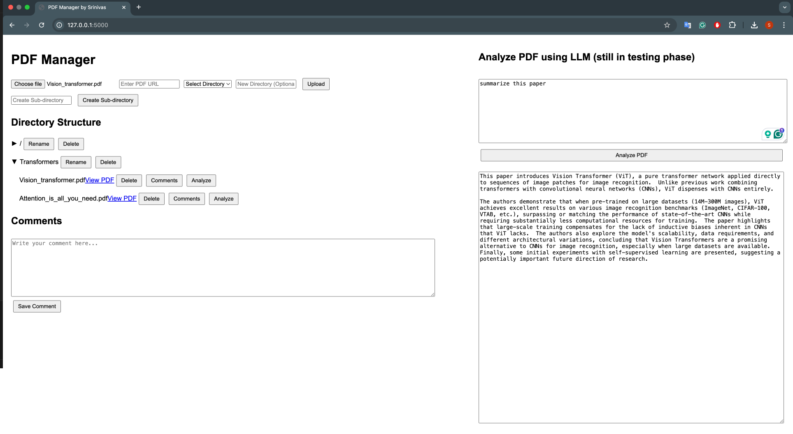

This is my current ongoing project to provide an LLM-integrated tool to effectively organize the literature study during extensive research work. The tool will use the LLM to summarize papers, allow users to make their own comments, and use the LLM to verify comments by providing related PDFs as knowledge of truth.

Here is my initial prototype of the front end:

